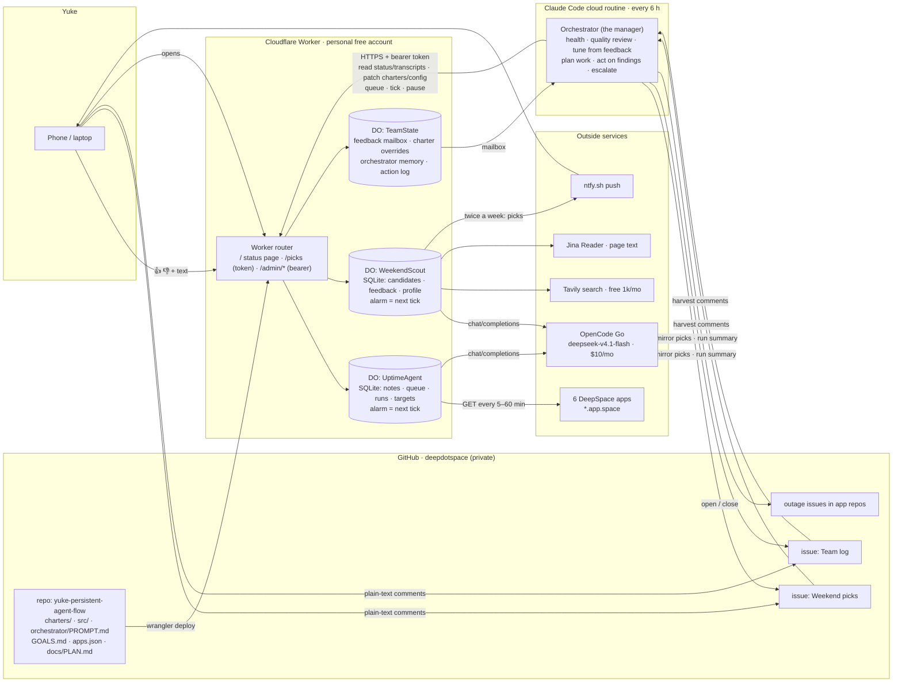

# yuke-persistent-agent-flow — plan

## Context

Teammate ask: everyone runs persistent, low-oversight agents on DeepSeek V4.1 Flash via the $10/mo OpenCode Go subscription, separate from day-to-day Claude/Codex coding. Scaled to **2 agents for now**. Yuke wants one self-contained repo, pushed **private to the `deepdotspace` GitHub org**, deployed to a **personal free Cloudflare account**, with one Claude orchestrator that genuinely manages the agents (not just reports on them) and a public status page that proves to the teammate the agents are running.

"Persistent" is satisfied by design, not by a hot loop: durable memory in SQLite, LLM-chosen next action, LLM-chosen next wake time, visible continuity on a status page.

Verified so far (read-only):
- OpenCode Go credential already exists at `~/.local/share/opencode/auth.json` under key `opencode-go` (`{type:"api", key}`).
- Go's OpenAI-compatible endpoint: `https://opencode.ai/zen/go/v1` (`/chat/completions`, `/models`), `Authorization: Bearer <key>`, model id `deepseek-v4.1-flash` (= the teammate's "deepseek-flash-4-1").
- `gh` active account `yukewF2023` is an **admin of the `deepdotspace` org** → `gh repo create deepdotspace/yuke-persistent-agent-flow --private`.
- Wrangler has an oauth token but account unknown. Personal Cloudflare account is **yuke@deep.space**. Before first deploy: `npx wrangler whoami`; if it is not that account, Yuke runs `npx wrangler login` (browser OAuth, I can't do it) and picks the personal account.
- This plan file is committed to the repo as `docs/PLAN.md` and kept updated.
- Node 24, Homebrew, tmux + opencode installed. No global wrangler (project-local).
- Library versions: `agents` 0.24, `ai` 7, `@ai-sdk/openai-compatible` 3, `wrangler` 4.136.

Decisions from Yuke:
- **Agent 2 = Weekend Scout** (personal): researches CT weekend things to do (date ideas, coffee brewing sessions, learn-how-to workshops, farm experiences…), remembers what it already suggested, delivers picks twice a week; the orchestrator tunes its search profile from Yuke's rare feedback or its own judgement. DMV and Global Entry were explored and dropped (DMV infeasible; Global Entry not wanted).
- **Uptime targets (final for now):** taskspace.app.space, news.app.space, tickets.app.space, recipe-tracker.app.space, podcastify.app.space, gist.app.space.
- **Orchestrator: Claude Code cloud routine, every 6 h**, acting as a real manager (see "Orchestrator loop"). Digest demoted to a run log; the deliverable is actions taken + "needs a human" list.

## Where everything lives (end to end)

```
┌──────────────────────────────┐  reads status/transcripts; patches charters,   ┌──────────────────────────┐
│ Claude Code cloud routine    │  queues, config; forces ticks; pauses          │ Cloudflare Worker (free) │
│ "orchestrator" (every 6 h)   │ ───────────── HTTPS + Bearer token ──────────► │  personal account        │
│                              │ ◄──────────── JSON status / notes ──────────── │                          │
└──────┬───────────────┬───────┘                                                │  ┌─────────────────────┐ │
       │ opens/closes  │ team-log comment: actions + needs-human                │  │ DO: UptimeAgent     │ │
       │ issues in     ▼                                                        │  │  SQLite: notes,     │ │
       │ app repos   ┌──────────────────────────────┐                           │  │  queue, runs, kv    │ │
       │             │ GitHub deepdotspace (private) │  wrangler deploy (Mac)   │  │  alarm = next tick  │ │
       └───────────► │ yuke-persistent-agent-flow    │ ───────────────────────► │  └─────────────────────┘ │
                     │  charters/ src/ orchestrator/ │                           │  ┌─────────────────────┐ │
                     │  GOALS.md apps.json           │                           │  │ DO: WeekendScout    │ │
                     └──────────────────────────────┘                           │  └─────────────────────┘ │
                                                                                │  ┌─────────────────────┐ │
   Teammate opens                                                               │  │ DO: TeamState       │ │
   https://<worker>.workers.dev/  ◄──────── public read-only status page ────── │  │  charter overrides, │ │
                                                                                │  │  orchestrator memory│ │
                                                                                │  └─────────────────────┘ │
                                                                                └────────────┬─────────────┘
                                                                                             │ POST /chat/completions
                                                                                             ▼
                                                                                OpenCode Go https://opencode.ai/zen/go/v1
                                                                                model deepseek-v4.1-flash, $10/mo key
                                                                                secret OPENCODE_API_KEY
```

Same picture as Mermaid (renders on GitHub):



Six pieces, one job each:

1. **Repo** `/Users/yukewu/Desktop/Work/yuke-persistent-agent-flow` → GitHub `deepdotspace/yuke-persistent-agent-flow` (private). Code, charters, orchestrator prompt, team goals, app→repo map, setup scripts, docs.
2. **Cloudflare Worker + Durable Objects** (personal free account). One DO per agent (`getAgentByName(env.UPTIME, "main")`), state in each DO's SQLite, self-scheduled alarms = "kept running". Plus one small `TeamState` DO for team-level state (charter overrides, orchestrator memory/log). The Worker is a thin router (10 ms CPU); LLM/SQL work runs inside DOs.
3. **OpenCode Go**: sole LLM provider for the agents. Key copied from the local opencode auth file into `.dev.vars` (gitignored), pushed with `wrangler secret bulk`.
4. **Claude Code cloud routine**: the manager. Every 6 h. Full loop below. Needs `WORKER_URL` + `ORCHESTRATOR_TOKEN` in its env and GitHub access (routine sandbox has the repo; issue ops via `gh`). Fallback if the routine can't hold the token: Mac launchd running `claude -p` with the same prompt.
5. **GitHub as the human-facing surface**: outage issues in the affected app repo (mapping in `orchestrator/apps.json`, fallback = this repo); one standing "Team log" issue where each orchestrator run comments actions + needs-human.
6. **Status page** at Worker root: per agent → last/next tick, ticks today/total, token spend, last runs, last 15 notes; plus an "Orchestrator" card: last run, actions taken, charter version per agent. 60 s auto-refresh.

## Parallelism: why the two agents are genuinely parallel

- Each agent is its **own Durable Object** with its **own alarm, own SQLite, own lock, own budget counters**. Nothing is shared between them at runtime. Cloudflare wakes each DO independently; their ticks overlap in wall time whenever their alarms coincide, and neither waits for the other.
- Free-plan limits (subrequests, CPU) are **per invocation**, so one agent's tick never eats the other's headroom. The only shared resource is the OpenCode Go rate limit; each agent handles its own 429 backoff.
- The Worker router never serialises them: `/admin/agents` fans out to both stubs with `Promise.all`.
- The orchestrator manages them as two independent workers with separate queues, charters and budgets, and can reassign work between them.
- Proof on the status page: two cards with different tick cadences and overlapping run timestamps; the team log shows both being managed in the same orchestrator run.
- Adding agent 3–5 later = one new DO class + charter; nothing else changes.

## Agent 2: "Weekend Scout" (personal, parallel to uptime)

**Job.** Find things Yuke could do on weekends within ~45 min of West Hartford, CT: date ideas, coffee brewing/cupping sessions, "learn how to X" workshops, farm experiences (pick-your-own, farm dinners), seasonal events, hikes/markets. Deliver **twice a week** (default Wed 18:00 and Fri 12:00 America/New_York): 5–7 picks with date/time, place, price, why-it-fits, link. Never repeat something already recommended unless Yuke asked for it again.

**Search is native to the agent** (the agent runs the searches itself, from its own tools, with a *search profile* the orchestrator owns):
- `web_search(query, {days?})` → **Tavily** (free 1,000 credits/mo, no card; basic search = 1 credit). Cap 25/day in code.
- `read_page(url)` → Jina Reader (`https://r.jina.ai/<url>`, clean markdown, free at low volume) for event pages that need details.
- `events_search(keyword, start, end)` → **Ticketmaster Discovery** (`stateCode=CT`, free key, 5,000 calls/day) — optional, structured events.
- Direct fetch of a curated source list in the profile (ctvisit.com events, CTNow/Hartford Courant things-to-do, Eventbrite CT category pages via Jina, town calendars for West Hartford / Hartford / Farmington / Glastonbury, farm sites).

**Search profile** (`kv.config:search_profile`, owned by the orchestrator, editable by Yuke via feedback):
```json
{ "home": "West Hartford, CT", "radius_min": 45,
  "categories": ["date idea","coffee brewing session","learn how to","farm experience","seasonal","outdoors","market"],
  "keywords": ["Hartford weekend events","CT farm tour","coffee cupping Hartford","pottery class Hartford","apple picking CT"],
  "exclusions": ["21+ nightlife","kids-only"], "budget_max_usd": 80,
  "sources": ["https://ctvisit.com/events", "..."], "deliver": ["Wed 18:00","Fri 12:00"], "tz": "America/New_York" }
```

**Tick modes** (the LLM still picks wake times; the charter gives the rhythm):
- *Research tick* (≈2/day, Mon–Fri): pick 6–10 queries from the profile (rotate; the LLM may invent 1–2 of its own based on season/holidays), run them, read the 3–5 most promising pages, upsert into `candidates(id, url, title, when_start, when_end, place, price, category, summary, source, first_seen, score, status)` with dedupe on normalized url / (title+date). Skip anything already `recommended` or `rejected`.
- *Delivery tick* (Wed 18:00, Fri 12:00 ET; code passes `next_delivery_at` as a hint so the LLM schedules onto it): rank candidates for the coming weekend (and next weekend for ticketed things), pick 5–7 across categories, write one `recommendation` note (markdown), mark them `recommended`, push to phone via **ntfy** (`POST https://ntfy.sh/<random-topic>`; free, no login; topic name is a secret), then schedule the next research tick.
- *Quiet time*: Sat/Sun and nights → 6–12 h wakes. Budget: ~25 Tavily searches/day max, ~10 page reads/day.

**Memory that makes it an agent, not a search cron:** `candidates` history, `recommended` list with dates, `feedback` ratings (from the loop below), profile version it last used, what worked (categories with 👍) → the LLM sees a digest of this every tick and adjusts queries itself; the orchestrator adjusts the profile on a slower loop.

**Explored and dropped for agent 2:** CT DMV appointments (live probe: Salesforce scheduler requires name/DOB/address + captcha *before* any timeslot → infeasible unattended; documented in README). Global Entry slot watcher (feasible; Windsor Locks is the only permanent CT center; Yuke didn't want it — kept in README as a 30-line optional watch).

## Human feedback loop (how Yuke steers the boss agent)

**Where the manager actually is (important):** the manager (Claude) is *not* inside the Worker. The Worker holds a **mailbox** (TeamState `feedback` table) plus the agents. Everything below only *writes to the mailbox*; the manager reads it on its next scheduled run (≤ 6 h) and acts. For "act now", run the manager locally: `scripts/orch.sh manager-now` = `claude -p "$(cat orchestrator/PROMPT.md)"` with `WORKER_URL`/`ORCHESTRATOR_TOKEN` from `.dev.vars` — same prompt the cloud routine uses, just triggered by hand.

Four input channels, all landing in the same mailbox:

1. **Picks page with buttons (primary, phone-friendly).** `GET /picks?k=<PICKS_TOKEN>` on the Worker — a private page (token in the link, never indexed; token is a wrangler secret, separate from the orchestrator token). Shows the latest recommendation sets, each pick with **👍 / 👎** buttons and an optional one-line "why", plus a free-text box ("tell the manager…"). Buttons `POST /api/picks/rate {candidateId, rating, reason}` → written straight into the scout's `feedback` table (so the scout's own next tick already knows) *and* into the team mailbox (so the manager tunes the profile). The text box → `POST /api/picks/feedback {text}` → mailbox. Both endpoints require the same `k` token. Static HTML + ~40 lines of JS, no framework; also linked from the public status page as a locked "Picks" tab (the link itself needs the token).
2. **GitHub thread (text).** The orchestrator mirrors each recommendation set as one comment on a standing **"Weekend picks"** issue and posts run summaries on the **"Team log"** issue. Plain-language replies ("more outdoors", "we're only free Oct 11", "pause the scout for two weeks") are harvested by the orchestrator (`gh issue view N --comments --json`, comments by Yuke newer than `last_seen_comment_at`) → mailbox.
3. **CLI (from the laptop).** `scripts/orch.sh feedback "<text>"` → `POST /admin/team/feedback` → mailbox. `orch.sh prefs` prints the scout's current search profile + version. `orch.sh manager-now` runs the manager immediately (see above).
4. **Repo file (durable preferences).** `orchestrator/GOALS.md` holds standing preferences ("we like farms, ≤ 45 min drive, weekends only, ~$80"). Read every run; edits are a normal commit.

**What the orchestrator does with feedback** (added to its loop as step 3b, "Tune"): parse each new item → update `prefs` in its TeamState memory → translate into concrete changes: `PATCH /admin/agents/scout/config` (search profile: keywords, categories, exclusions, radius, delivery times), `PUT /admin/agents/scout/charter` (behavioural rules, e.g. "always include one free option"), `POST /admin/team/feedback/:id/apply` marking it applied with what changed, and a one-line reply on the same GitHub thread: "Applied: dropped coffee events, added 'hiking' and 'farm dinner'; profile v7." Ratings on specific picks are written to the scout's `feedback` rows (candidate id → 👍/👎 + reason) so the scout's own memory improves immediately, not just the profile.

**Without any input** the orchestrator still tunes on its own judgement: category balance of past picks, 👍/👎 ratios, candidates with zero engagement, seasonality (foliage in Oct, holiday markets in Dec), and Tavily credit burn. Every change is versioned and visible on the status page ("scout profile v7, changed by orchestrator: …") so Yuke can veto with one comment.

## How an agent tick works (agent, not cron job)

1. DO alarm fires the `tick` schedule set by the previous tick. (`onStart()` runs on every DO wake and calls `ensureScheduled()` so an agent can never be left without a future wake.)
2. Lock via `kv.lock_until` (skip if a tick is running). Pause check (`kv.paused` → keep-alive schedule only).
3. Load context, SQL only: effective charter (bundled `charters/<agent>.md` + override from TeamState if any), open queue (≤10), last 10 notes, last 3 run summaries, config overrides, today's token spend.
4. **Observe** (deterministic, bounded): subclass `observe()` fetches through a counted `ctx.fetch` (10 s timeout, ≤5 concurrent, hard subrequest cap). Uptime: GET each target, compare with the `targets` table, mark `changed`. ≤4 KB JSON observation.
5. **Budget gate**: daily token budget exhausted or LLM 429 backoff active → deterministic `fallbackDecide()` (change notes + `defaultWake`), skip the LLM.
6. **Decide** (LLM tool loop via `generateText`): system = charter + operating rules + memory digest; user = observation + queue. Tools: `write_note`, `queue_add`, `queue_complete`, `queue_drop`, `remember`, `finish{summary,next_wake_seconds,reason}` + subclass tools (`check_url`). Stop at `finish` or `MAX_STEPS`=8. Shared subrequest counter ≤ ~28 (under the 50 cap).
7. Extract decision; clamp `next_wake` to [60 s, 6 h]; `defaultWake(obs)` if the model didn't call `finish`.
8. Persist run row (steps, tokens, subrequests, ms, next_wake, summary, truncated transcript); add tokens to `kv.budget:<date>`; prune (2000 notes / 400 runs).
9. `ensureScheduled("tick", next_wake)`: list pending `tick` schedules, cancel all, `this.schedule(next_wake, "tick", {reason})`, store id + `next_tick_at`. Exactly one pending schedule always. Clear lock.
10. Error path: never throw out of `tick()` (avoids DO's 6× alarm retry burning tokens); `notes(kind='error')`, run `status='error'`, wake = min(2× last, 6 h) floor 5 min, still reschedule.

## Orchestrator loop (the manager; `orchestrator/PROMPT.md`)

Runs every 6 h as a Claude Code cloud routine with the repo checked out. Order matters; each step acts, then logs.

1. **Recall.** `GET /admin/team/state` → its own memory from last run (decisions, open issues it owns, charter versions, watch-list). Read `orchestrator/GOALS.md` (Yuke-owned team goals) and `orchestrator/apps.json` (url → GitHub repo).
2. **Health.** `GET /admin/agents`. For each agent: `nextTickAt` in the past by > 2× wake max → `POST /ensure` then `/tick?async=1`; ≥3 consecutive `error` runs → read `GET /runs/:rid` transcript, diagnose, patch `config` (wake bounds, targets) or charter; token spend > 80% of daily budget by midday → `PATCH config` raising `wakeBounds.min`; over budget → `pause` + note.
3. **Quality review.** Sample last 20 notes + last 5 transcripts per agent. Check against charter: duplicate/"all healthy" notes, missing `finish`, wrong wake choices, ignored queue items. On drift → `PUT /admin/agents/:id/charter` with a revised override (versioned; diff recorded in TeamState log and as an `admin` note on the agent). This is the "manager rewrites instructions" action.
3b. **Tune from feedback.** Read new `feedback` rows + new GitHub comments by Yuke → update prefs memory → patch scout search profile / charter → mark applied → reply on the thread (see "Human feedback loop").
4. **Work planning.** Turn `GOALS.md` items not yet reflected into queue items (`POST /queue`, source=orchestrator). Items in `doing` for > 24 h → `reassign` or `drop` with reason. Close the loop on completed items (read `result`, decide follow-up).
5. **Act on findings.** Uptime `change` notes: target down for ≥ 2 consecutive checks and no open issue → `gh issue create` in the mapped repo (title, URL, status code, latency history, first-seen), remember issue number in TeamState. Target recovered → comment + close. Agent 2 findings (later) get their own action rules in the same section.
6. **Escalate.** Anything it could not resolve (auth failures, budget exhausted repeatedly, a target down > 6 h, unclear goal) → "Needs a human" list.
7. **Log.** `PUT /admin/team/state` (memory), `POST /admin/team/log` (structured actions), and one comment on the standing GitHub "Team log" issue: actions taken (bulleted, terse), needs-human (may be empty), agent stats line. No prose recap beyond that.

Guardrails: the orchestrator never pushes code, never merges, never edits charters in git (overrides live in TeamState so a human can review/promote them into `charters/*.md`), never spends beyond the agents' budget knobs. All admin calls go through `scripts/orch.sh`, which the routine uses too, so the same commands work from a laptop.

## Repo layout

```
yuke-persistent-agent-flow/
  README.md                 what/why, how it satisfies the ask, run/deploy/verify, cost bounds
  package.json              dev, deploy, types, setup:env, secrets:push, tail, check
  tsconfig.json             extends agents/tsconfig
  wrangler.jsonc            3 DO bindings (UPTIME, SCOUT, TEAM), exports{type:durable-object,storage:sqlite},
                            Text rule for *.md, vars (LLM_BASE_URL, LLM_MODEL, UPTIME_TARGETS, MAX_STEPS,
                            MAX_OUTPUT_TOKENS, DAILY_TOKEN_BUDGET, SCOUT_PROFILE seed JSON), secrets.required [OPENCODE_API_KEY,
                            ORCHESTRATOR_TOKEN, TAVILY_API_KEY, PICKS_TOKEN]; optional secrets TICKETMASTER_API_KEY, NTFY_TOPIC, observability.enabled
  .gitignore                node_modules .wrangler .dev.vars* .env* dist
  .dev.vars.example
  charters/
    uptime.md               standing instructions, "done" definition, wake policy, note-only-on-change rule
    weekend-scout.md        job, research/delivery rhythm, pick format, no-repeat rule, no-personal-data rule
  orchestrator/
    PROMPT.md               the routine prompt: the 7-step loop above, with exact commands
    GOALS.md                Yuke-owned team goals (seed: "keep all 6 apps observed; report outages within 10 min")
    apps.json               { "https://taskspace.app.space": "deepdotspace/<repo>", ... } (fill what's known;
                            unknown → fallback to this repo)
    ROUTINE.md              how the routine was created (cron `0 */6 * * *`, env vars), how to re-create it
  scripts/
    setup-env.mjs           ~/.local/share/opencode/auth.json → .dev.vars (+ random ORCHESTRATOR_TOKEN + random PICKS_TOKEN + random NTFY_TOPIC);
                            prompts for TAVILY_API_KEY / TICKETMASTER_API_KEY if missing; chmod 600
    orch.sh                 curl wrappers: status | agents | queue <agent> "<task>" | tick <agent> | pause/resume
                            | config <agent> <json> | charter <agent> <file> | team-state get/put | team-log
                            | feedback "<text>" | prefs | manager-now | picks-link
  docs/
    orchestrator.md         admin API contract with curl examples
  src/
    index.ts                router: GET / (HTML), GET /api/status, GET /api/agents/:id/{notes,runs,queue},
                            /admin/* (Bearer, timingSafeEqual); re-exports DO classes; NO routeAgentRequest
    admin.ts                admin handlers → RPC on agent stubs + TeamState
    status-page.ts          string-template HTML (agents + orchestrator card)
    picks-page.ts           private /picks page (token-gated): picks with 👍/👎 + why + free-text box; ~40 lines JS
    llm.ts                  createOpenAICompatible({baseURL, apiKey}) → model; error classes (429/401),
                            usage accounting; plain-fetch fallback if tool calling misbehaves
    types.ts                Env, Note, QueueItem, RunRow, TickResult, AgentStatus, TeamState
    agents/base-agent.ts    BaseAgent extends Agent: schema, runTick, ensureScheduled, budgets, RPC surface,
                            effective-charter resolution (bundled + override)
    agents/uptime-agent.ts  observe/tools/defaultWake/charter
    agents/weekend-scout-agent.ts  observe = load profile + candidates digest + next_delivery_at; tools: web_search,
                            read_page, events_search, candidate_upsert, candidate_mark, recommend, notify; defaultWake by mode
    tools/search.ts         Tavily client (daily cap, credit accounting)
    tools/reader.ts         Jina Reader fetch (size cap 32 KB)
    tools/ticketmaster.ts   Discovery API (optional; no-op if key missing)
    tools/notify.ts         ntfy.sh push (optional; no-op if topic missing)
    team-state.ts           plain DurableObject (SQLite): kv (orchestrator memory, charter:<agent> override
                            + version), log (orchestrator actions)
    tools/common.ts         write_note, queue_*, remember, finish
    tools/http.ts           check_url (status, latency, expected text)
```

## SQLite schema

Per agent DO (`CREATE TABLE IF NOT EXISTS` in `onStart`):
- `kv(key, value, updated_at)`: paused, tick_schedule_id, last_tick_at, next_tick_at, run_count, last_summary, budget:<date>, config:<name>, lock_until, llm_backoff_until
- `notes(id, ts, kind[change|finding|thought|error|admin], title, body, run_id, meta)`
- `queue(id, created_at, updated_at, status[open|doing|done|dropped], priority, task, source[orchestrator|self|reassign:<agent>], result)`
- `runs(id, started_at, finished_at, trigger[alarm|manual|start], status[ok|error|skipped|paused|budget], steps, input_tokens, output_tokens, subrequests, llm_ms, wall_ms, next_wake_s, summary, error, transcript)`
- `seen_items(id, kind, first_seen, meta)` (for future agents)
- Uptime extra: `targets(url PK, expect, last_status, last_ok, last_latency_ms, last_checked, last_changed, consecutive_failures, last_error)`
- Scout extra: `candidates(id PK, url, title, when_start, when_end, place, price, category, summary, source, first_seen, score, status[new|recommended|rejected|expired], recommended_at)`, `feedback(candidate_id, rating, reason, ts)`, `kv: search_profile_version, tavily_used:<date>, next_delivery_at`

TeamState DO:
- `kv(key, value, updated_at)`: `orchestrator:memory` (JSON), `orchestrator:last_run_at`, `charter:<agent>` (override text), `charter:<agent>:version`, `issues:<url>` (open issue ref)
- `log(id, ts, actor, action, target, detail)` — orchestrator actions, last 500 kept
- `feedback(id, ts, source[github|cli|goals], author, text, status[new|applied|ignored], applied_detail)`

## Admin API (Bearer `ORCHESTRATOR_TOKEN`)

| Route | Effect |
|---|---|
| `GET /admin/agents` | full status both agents + open queues + pending schedules + charter versions |
| `POST /admin/agents/:id/queue {task,priority?}` | queueAdd(source=orchestrator) |
| `DELETE /admin/agents/:id/queue/:qid` | queueDrop |
| `POST /admin/agents/:id/reassign {queueId,to}` | move item between agents |
| `POST /admin/agents/:id/tick[?async=1]` | force a tick now |
| `POST /admin/agents/:id/pause` / `resume` | flag + schedule handling |
| `PATCH /admin/agents/:id/config {targets?|wakeBounds?}` | kv.config:* override, admin note |
| `PUT /admin/agents/:id/charter {text,reason}` / `DELETE` | charter override in TeamState (version++), admin note on agent |
| `GET /admin/agents/:id/runs/:rid` | full transcript |
| `POST /admin/agents/:id/ensure` | repair missing schedule |
| `GET|PUT /admin/team/state` | orchestrator memory (JSON) |
| `GET|POST /admin/team/log` | orchestrator action log |
| `GET|POST /admin/team/feedback`, `POST /admin/team/feedback/:id/apply` | human feedback inbox for the orchestrator |
| `POST /admin/agents/scout/rate {candidateId, rating, reason}` | write a 👍/👎 into the scout's memory |

Public (no auth): `GET /`, `GET /api/status`, `GET /api/agents/:id/{notes,runs,queue}`, `GET /api/team/log?limit=`.

Picks (token `k` = `PICKS_TOKEN`, query param or header): `GET /picks`, `GET /api/picks` (latest sets + ratings), `POST /api/picks/rate {candidateId,rating,reason?}`, `POST /api/picks/feedback {text}`. Rate-limited per token (60/min) and never exposes admin routes.

## Uptime agent specifics

- Targets: `kv.config:targets` ?? `UPTIME_TARGETS` var. Seed (final): `https://taskspace.app.space`, `https://news.app.space`, `https://tickets.app.space`, `https://recipe-tracker.app.space`, `https://podcastify.app.space`, `https://gist.app.space`, each `expect: "<title"` (adjust per app after first real check).
- `ok = status<400 && body.includes(expect)`; changed = ok flipped / status changed / latency > 3× baseline.
- `defaultWake`: any down → 300 s; recovery → 900 s; all ok → 1800 s, 3600 s after 6 clean checks.
- Code-level guard: reject duplicate `change` note titles within 30 min. Charter forbids "all healthy" notes and secrets in notes.

## Cost bounds

| Bound | Value |
|---|---|
| LLM steps / tick | 8 (`stopWhen: isStepCount`) |
| Output tokens / step | 700 |
| Subrequests / tick | ≤ ~28 (shared counter) |
| Daily tokens / agent | 400k → fallback mode |
| Wall time | LLM abort 90 s, fetch 10 s, lock 120 s |
| Expected agent spend | ~0.5M tokens/day at 30-min cadence ≈ $0.10–0.20/day, far under Go's $60/mo |
| Cloudflare | free plan; ~10–15 row writes/tick vs 100k/day; few hundred requests/day |
| Tavily | ≤25 searches/day → ≤750/mo of the 1,000 free credits |
| Orchestrator | 4 short Claude runs/day |

## Implementation sequence

1. Scaffold repo, `git init`, `npm i agents ai @ai-sdk/openai-compatible zod` + dev `wrangler typescript`; `wrangler.jsonc` with `exports` (verify wrangler 4.136 accepts it in `wrangler dev`; else legacy `migrations.new_sqlite_classes`; mutually exclusive).
2. `scripts/setup-env.mjs` → `.dev.vars`. `llm.ts` + temporary `/debug/llm` smoke route against DeepSeek (delete after).
3. `base-agent.ts` (schema, RPC, ensureScheduled, runTick with stub observe) + `team-state.ts` → confirm `/api/status` shows one pending schedule and run_count climbing under `wrangler dev`.
4. `tools/` (common, http, search, reader, ticketmaster, notify), `uptime-agent.ts`, `charters/uptime.md`; `weekend-scout-agent.ts`, `charters/weekend-scout.md`, seed `SCOUT_PROFILE`.
5. `admin.ts`, `status-page.ts`, `docs/orchestrator.md`, `scripts/orch.sh`, `orchestrator/{PROMPT,GOALS,ROUTINE}.md`, `apps.json`, README.
6. `wrangler whoami` → personal account; `wrangler secret bulk .dev.vars`; `npm run deploy`; `wrangler tail` for two cycles.
7. `gh repo create deepdotspace/yuke-persistent-agent-flow --private --source . --push`; create the standing "Team log" issue.
8. Create the cloud routine (`schedule` skill) from `ROUTINE.md`, run once manually, confirm it acts (e.g. seeds queue from GOALS.md) and comments on the Team log issue.

## Verification

Local (`npm run dev`, http://localhost:8787):
- `GET /api/status` → both agents, `nextTickAt` set for both, team log empty.
- `POST /admin/agents/scout/tick` (research) → transcript shows Tavily queries + page reads; `candidates` grows; Tavily counter increments; re-tick → dedupe holds.
- Force a delivery tick (`{reason:"deliver"}`) → one `recommendation` note with 5–7 picks in the format; candidates flip to `recommended`; ntfy push received on phone (if topic set).
- Open `/picks?k=…` in the built-in browser: picks render; click 👍 on one → `feedback` row on the scout + mailbox row; type in the text box → mailbox row. Wrong/missing `k` → 401. Screenshot.
- `orch.sh feedback "more outdoors"` → mailbox row; `orch.sh manager-now` → profile patched (version+1), feedback marked applied, admin note on scout, reply comment on the GitHub thread.
- `POST /admin/agents/uptime/tick` → TickResult; all 6 targets ok → no notes. Add a 404 target via config, tick → "down" note + 300 s wake; restore → "recovered" note.
- `PUT /admin/agents/uptime/charter` → next tick's transcript shows the override text; version increments; admin note present.
- Unauthenticated POST → 401. Two concurrent ticks → one `skipped`. `/ensure` ×3 → 1 pending schedule. Restart `wrangler dev` → history persists, 1 pending schedule.
- Leave dev running 10+ min → run_count increments on its own.

Prod:
- Deploy, open `https://yuke-persistent-agent-flow.<subdomain>.workers.dev/` in the built-in browser, screenshot.
- Wait two alarm cycles untouched; tick count increments, `nextTickAt` always in the future. Next day: runs spanning >24 h.
- Orchestrator dry run from the Mac with `scripts/orch.sh` + `claude -p orchestrator/PROMPT.md` before creating the routine; then the routine's first run comments on the Team log issue.

## Free-plan gotchas baked into the design

- Worker 10 ms CPU → router only; all work in DOs. 50 subrequests/invocation → shared counter cap 28. 6 concurrent connections → chunk fetches at 5.
- DO evicted after ~70–140 s idle → all state in SQL; `onStart` idempotent + cheap.
- Alarm at-least-once + DO retry on throw → `tick()` never throws.
- `exports` vs `migrations` mutually exclusive; decide before first deploy.
- Public `/` shows notes verbatim → charter forbids secrets in notes; admin/charter notes redact values.
- OpenCode Go: 5-hour window = 20% of monthly; 429 → backoff flag, double wake. Peak pricing 01–04 & 06–10 UTC weekdays.
- DeepSeek may skip `finish` / emit bad tool JSON → `defaultWake` + `finishReason` logging keep it alive; plain-fetch fallback in `llm.ts`.

## Open items

- **Tavily: signed up, key in hand (2026-09-22).** `setup:env` prompts for it in the terminal (never pasted into chat or committed). Optional: Ticketmaster developer key; install the ntfy app and subscribe to the generated topic.
- Seed search profile: confirm radius (45 min), budget ($80), delivery times (Wed 18:00 / Fri 12:00 ET), and any must-have categories.
- `apps.json` repo mapping for the 6 apps (fill from deepdotspace org; unknown → fallback to this repo).
- Confirm personal Cloudflare account via `wrangler whoami` before deploy.
- Whether the cloud routine can hold `ORCHESTRATOR_TOKEN` + use `gh`; else Mac launchd fallback.

## Status (2026-09-22)

Built and verified locally (`wrangler dev`): both agents bootstrap one alarm each, tick, persist runs/notes, dedupe schedules, lock against concurrent ticks; uptime writes DOWN/RECOVERED notes with 300 s / 900 s wakes; charter overrides version; admin auth 401s; picks page renders, gates on token, rates and sends feedback to the mailbox; CLI wrapper works on macOS bash 3.2. Repo pushed private to `deepdotspace/yuke-persistent-agent-flow`; issues #1 Team log, #2 Weekend picks created. Secrets pushed to the personal Cloudflare account.

Blocked on account-side actions (Yuke):
1. OpenCode dashboard → workspace Privacy → region **Global** (DeepSeek V4.1 Flash on Go refuses otherwise: "This Go model requires Global regions").
2. Cloudflare dashboard → open **Workers & Pages** once on the yuke@deep.space account to create the workers.dev subdomain, then `npm run deploy`.
3. Paste the Tavily key in the open terminal tab (`npm run setup:env`), then `npm run secrets:push`.

Gotchas learned: OpenCode Go requires `x-opencode-session` (stable per conversation) and a client-specific `user-agent`; DurableObjectStub<Agent subclass> types recurse too deep for tsc → narrow RPC interfaces in `src/rpc.ts`; SPA apps return 200 + `<title` for any path, so test "down" with an `expect` mismatch, not a fake path.

## Live (2026-09-22, later)

Deployed to the personal account: **https://yuke-persistent-agent-flow.yuke-521.workers.dev** (status page; `/api/status`; private `/picks?k=…`). All three account steps done (OpenCode region Global, workers.dev subdomain, Tavily key). Verified on production with DeepSeek V4.1 Flash: uptime tick ok (6/6 targets), scout research tick saved 10 dated candidates, forced delivery tick produced 7 picks with reasons + ntfy push. Fixes made on the way: OpenCode Go needs `x-opencode-session` + custom user agent; Jina Reader 429s from Cloudflare → direct fetch + Tavily extract fallback; DeepSeek batched all saves into one cut-off reply → "save as you go" rule, 2500 output tokens, forced `finish` on the last step via `prepareStep`.

Orchestrator routine: creation refused with `repo_access_denied` — the Claude GitHub connection must include the **deepdotspace** org. Retry `RemoteTrigger create` once granted (cron `0 */6 * * *`, claude-sonnet-5, tools Bash/Read/Glob/Grep, env Default, WORKER_URL + token in the private prompt).
